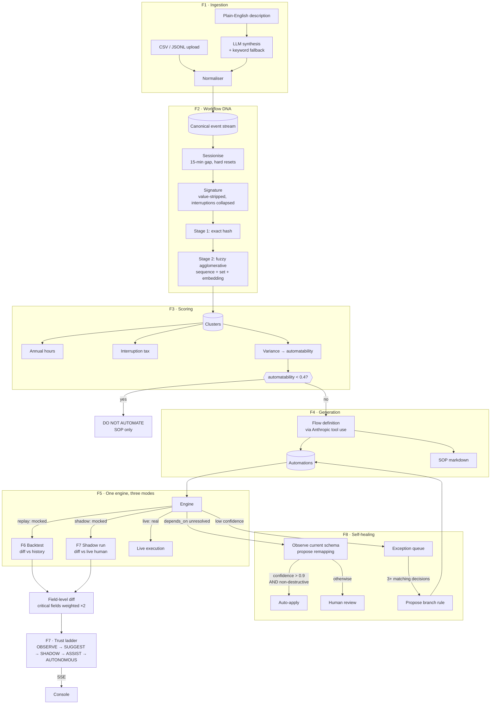

# LOOP — Workflow Intelligence Platform

**From _"this task is repetitive"_ to _"this task can now be automated"_ — and
then, crucially, to _"this task has earned the right to run unattended."_**

LOOP ingests employee activity logs, mines them for repetitive workflows,
converts the good candidates into runnable automations, and then makes each
automation *earn* the trust to act, one measured rung at a time.

---

## The problem with detection-only tools

Finding repetitive work is the easy half. Every process-mining tool produces a
report saying "your team spends 400 hours a year on invoice entry." Then the
report is read, nodded at, and filed.

The hard half is the part nobody wants to own: **actually turning the automation
on.** No finance manager will let software post to a ledger on day one because a
dashboard claimed 94% accuracy. And they are right not to.

So LOOP's central feature is not the detection. It is the **trust ladder**: a
mechanism by which an automation demonstrates, against real human work, that it
deserves the next increment of autonomy — and gets demoted the moment it does
not.

---

## What it does

| | Feature | The idea |
|---|---|---|
| **F0** | **Observation & onboarding** | A browser extension that watches real activity across every web app, with consent, pause and revoke as first-class mechanics |
| **F1** | Ingestion & normalisation | CSV/JSONL logs, prose descriptions, or live collector signals, normalised into one canonical event stream |
| **F2** | Workflow DNA | Cross-employee pattern mining: sessionise → signature → two-stage cluster |
| **F3** | Scoring & Interruption Tax | Annual hours, context-switching cost, and an automatability score built from measured variance |
| **F4** | Automation generation + SOP | A runnable flow definition and a human-readable standard operating procedure |
| **F5** | Execution engine | One engine, three modes: `replay`, `shadow`, `live` |
| **F6** | Replay dry-run | Backtest against history and report honestly, failures named |
| **F7** | **Trust ladder & shadow mode** | The centrepiece: earn autonomy, don't demand it |
| **F8** | Self-healing & exception learning | Detect schema drift, propose remappings, learn branch rules from human decisions |

---

## Results on the shipped demo dataset

90 days of synthetic finance-operations activity for a fictional company,
"Northwind Industries": 14 employees, 3 teams, **8,539 events**, 5 seeded
workflow types.

Detection recovers all five, with **99.9% cluster purity** measured against
ground-truth labels that no detection service ever reads:

| Detected workflow | Instances | People | Hours/yr | Interruption tax | Automatability |
|---|---|---|---|---|---|
| Invoice email → ledger → confirmation | 819 | 6 | 358.6 | +117.3 | 0.65 |
| Purchase order → invoice match | 440 | 5 | 148.0 | +58.1 | 0.60 |
| Expense claim → policy check → notice | 259 | 4 | 72.2 | +62.5 | 0.60 |
| Report handling (weekly vendor ageing) | 19 | 4 | 16.0 | +1.7 | 0.69 |
| **Escalation handling** | 97 | 3 | — | — | **0.28 → DO NOT AUTOMATE** |

**701 hours/year** of repetitive task time, plus **263 hours/year** of
interruption tax that a conventional time-and-motion study would miss entirely.

### The result we are most pleased with

The fifth workflow is flagged **DO NOT AUTOMATE**, and it earns that flag from
the data:

> Step order varies across 99% of instances (97 distinct sequences observed);
> 7 branch point(s); judgement content scored 67%.

Measured: step-order entropy 1.00, 97 distinct sequences across 97 instances,
the most common covering 1%, judgement content 67%.

Nothing in the seed specification labels workflow 5 as unautomatable. It is
generated with genuinely high step-order entropy and genuinely judgement-laden
free text, and the variance detector has to reach that conclusion on its own.
A system that recommends automating everything is not giving advice — it is
selling software. Knowing when to stay out of the way is a feature.

### Honest backtest

Replaying the hero automation over 90 days of real historical triggers:

```
782 triggers · 725 correct · accuracy 0.9271 · 114 withheld by guard · 1 error

  23×  invoice denominated in USD; the flow has no currency-conversion rule
  20×  invoice denominated in EUR; the flow has no currency-conversion rule
  13×  invoice denominated in AED; the flow has no currency-conversion rule
   1×  unresolved dependencies: amount, vendor
```

Accuracy is **truncated, never rounded up**, and the failure modes are printed
next to it. Naming your own three failure modes is more convincing than a
suspiciously round 100%.

---

## Adding a domain

The platform is domain-agnostic. A team's repetitive work is **one file**:

```python
# apps/api/app/domains/sales.py
DOMAIN = DomainPack(
    key="sales", label="Sales", owner="Vijay",
    tools=["gmail", "crm", "sheets"],
    people=["u_rohit", "u_neha", "u_imran", "u_divya"],
    workflow_name="Inbound lead to CRM record",
    per_person_per_week=9.0,
    steps=[
        Step("gmail", "read",   "enquiry_email",     50, fields=["sender"]),
        Step("crm",   "search", "existing_contact",  55, fields=["customer"]),
        Step("crm",   "create", "lead_record",       95, fields=["customer"]),
        Step("gmail", "send",   "acknowledgement",   40, fields=["recipient"]),
    ],
)
```

The registry discovers it automatically — there is no list to edit, so two
people adding a domain on the same day do not conflict. Nothing in
`app/services/`, `app/api/` or `app/web/` changes.

**One workflow per domain, deliberately.** A domain you can explain end to end
is worth more than five you half-understand. See
[`apps/api/app/domains/README.md`](apps/api/app/domains/README.md).

## How LOOP gets to observe

A platform that can only be *fed* logs is a report generator. LOOP can also
**watch**, through onboarded sources:

| Tier | Coverage | Effort | Intrusiveness | Status |
|---|---|---|---|---|
| Describe a task in prose | ~10% | seconds | none | ✅ |
| Upload an activity log | ~25% | minutes | none | ✅ |
| **Browser extension** | **~70%** | **~2 min/person** | **low** | **✅** |
| Connect an app account (OAuth) | ~45% | hours + admin | medium | interfaces declared |
| Desktop agent | ~95% | days + IT rollout | high | not built |
| Screen recording | ~100% | doesn't scale | very high | needs an API key |

Coverage figures **do not add up** — the tiers overlap heavily, so the console
reports the best connected tier rather than the sum.

The browser extension is the highest-leverage tier: most enterprise work happens
in a browser, and it is the only one that sees **data copied out of one system
and pasted into another** — which is the problem statement, verbatim.

```
copy in gmail   → sha256("48,250.00")[:16] = a1b2c3d4e5f6a7b8
paste in sheets → sha256("48,250.00")[:16] = a1b2c3d4e5f6a7b8
                  ↓ same hash, different app, inside 10 minutes
        transferred_from: gmail  ·  transferred_to: sheets
```

Matching a **hash** proves the same value moved between two systems without ever
receiving the value.

**Applications onboard themselves.** The app vocabulary is a database table, not
an enum, so the first time somebody opens an internal tool nobody anticipated,
its hostname resolves to a brand name and registers automatically —
`https://app.northwind-erp.co.in/vendors/8812` becomes the app `northwind-erp`.
No code change, no migration.

**Privacy is implemented, not promised.** Metadata-only by default (the *name*
of the field you filled, never its value); URLs stripped of query values on both
the collector and the server, because a GET form puts every field into the URL;
consent recorded as a row that ingestion checks; pause governed centrally and
honoured within 30 seconds; and revoking a source deletes every event it
reported, by default rather than behind a flag. The `>3 distinct users`
organisational threshold is a privacy mechanism too: surfacing work at the level
of a group rather than an individual is what separates a process tool from a
surveillance tool.

See **[collectors/README.md](collectors/README.md)** for install steps, the full
collector API, and the two real bugs the collector tests caught.

## Quickstart

Requirements: Node ≥ 18.18, Python ≥ 3.11, [uv](https://docs.astral.sh/uv/).
No Docker, no Postgres, and **no API key** needed.

```bash
make setup     # venv + npm install + .env
make seed      # generate 8.5k events, run detection, build automations
make dev       # API on :8000 (docs at /docs), console on :3000
```

To watch real activity instead of synthetic: open **Observation → Browser
extension → Connect**, then load `collectors/browser-extension` unpacked from
`chrome://extensions`.

Then open <http://localhost:3000>.

### Docker

```bash
docker compose up --build     # Postgres + API + console, seeded on first boot
```

### Running with Claude

Every AI-backed feature has a deterministic fallback, so the entire product —
including flow generation, SOP writing, variance scoring, drift remapping and
rule proposal — works with no API key at all. Set one to get richer output:

```bash
echo 'ANTHROPIC_API_KEY=sk-ant-...' >> .env
```

The console's **System** page shows which path is active and the running spend.

---

## Architecture



### Five decisions worth explaining

**1. One engine, three modes — not three engines.**
`replay`, `shadow` and `live` differ in exactly two respects: whether side
effects are real, and what the result is compared against. The comparison lives
*outside* the engine, so shadow mode cost almost nothing once replay existed —
and the trust ladder is built entirely from that comparison. This is the
decision that made the scope achievable.

The safety guarantee is enforced in one place: the engine forces mock connectors
for `replay` and `shadow` regardless of deployment configuration, so a newly
added connector cannot forget to be safe.

**2. Interruptions are collapsed out of a workflow's identity.**
A workflow performed with a glance at the ERP halfway through is the same
workflow. Without collapsing `A → B → A` bounces, the hero workflow fragmented
into **227 near-identical clusters**, one per place an interruption happened to
land. Collapsing them yields **5**. The interruptions are not discarded — they
are read straight off the events by the Interruption Tax, which charges for
every one.

**3. Clustering blends three similarity signals, one of them order-invariant.**
Sequence distance cannot see that `sheets:create:row` and `erp:create:record`
are near-synonyms. Embeddings happily merge workflows that share vocabulary but
differ in structure. And crucially: a genuinely high-variance workflow performs
the same handful of steps in a different order every time, so under
order-sensitive similarity alone it **shatters into singletons and is never
surfaced at all** — the system would stay silent about exactly the workflows a
human most needs warning about. Set overlap holds those instances together long
enough for the variance detector to judge them.

The threshold (0.35) was chosen empirically, not guessed: same-workflow pairs
score ≥ 0.82 and different-workflow pairs score ≤ 0.09, and a test asserts that
margin stays wide so a future weight change cannot leave the threshold on a
knife edge.

**4. Flow outputs are generated from observed reality, not a fixed field map.**
An early version emitted generic outputs (`subject`, `sender`, `body`) that did
not exist in the source data. Replay found no comparable fields and reported a
meaningless accuracy. Steps now declare the payload keys actually observed on
them, which is what makes the backtest a measurement rather than a formality.

**5. Coverage counts guard holds against itself.**
An automation that stops and asks on 15% of invoices covers 85% of the work.
Reporting 100% while the backtest openly shows 113 withheld runs would be an
internal contradiction. Learned branch rules earn coverage back — but only when
their action resolves the case *without* a person: a rule that routes to a
manager automates the routing decision, and the manager still has to act.

### The trust ladder

```
OBSERVE ──→ SUGGEST ──→ SHADOW ──→ ASSIST ──→ AUTONOMOUS
```

In `SHADOW`, each trigger makes the automation record what it *would* do while
the human does the task for real. The two are diffed field by field, with
**critical fields weighted double** — a wrong vendor name and a wrong ledger
amount are not equally forgivable.

```
promote if   avg(score) over the last 5 runs ≥ 0.90
        AND  critical_mismatch_count == 0
        AND  runs ≥ 5
demote if    any critical mismatch in the last 3 runs
```

Two asymmetries are deliberate:

- **Promotion is manual, demotion is automatic.** A system that waits for
  permission to become safer is not a safety mechanism.
- **A single critical mismatch outvotes a perfect average.** No amount of good
  aggregate scoring buys past a wrong amount on a ledger.

The disabled Promote button always states exactly what is missing — *"needs 2
more shadow run(s)"* — rather than being mutely greyed out. Promotion state is
pushed to the console over **SSE**, so the confidence bar fills as runs land.

---

## API

| Method | Path | Purpose |
|---|---|---|
| `GET` | `/api/v1/sources` | Onboarded sources, tiers and coverage |
| `POST` | `/api/v1/sources` | Onboard a source, mint its collector token |
| `PATCH` | `/api/v1/sources/{id}` | Pause, resume, or rescope a source |
| `DELETE` | `/api/v1/sources/{id}` | Revoke, deleting the events it reported |
| `GET` | `/api/v1/collect/config` | What the collector should capture right now |
| `POST` | `/api/v1/collect/events` | Collector batch ingest (bearer token) |
| `POST` | `/api/v1/ingest/recording` | Read screen-recording frames (needs vision) |
| `POST` | `/api/v1/ingest/upload` | Ingest a CSV/JSONL activity log |
| `POST` | `/api/v1/ingest/describe` | Synthesise events from a prose description |
| `POST` | `/api/v1/ingest/redetect` | Re-run detection over stored events |
| `GET` | `/api/v1/ingest/events` | Browse the canonical event stream |
| `GET` | `/api/v1/clusters` | Detected workflows, split recommended / not |
| `GET` | `/api/v1/clusters/{id}` | Detail: step graph, per-user split, variants |
| `GET` | `/api/v1/clusters/{id}/sop` | Standard operating procedure |
| `GET` | `/api/v1/clusters/{id}/sop.md` | The same, as a download |
| `POST` | `/api/v1/clusters/{id}/generate-automation` | Build a runnable flow |
| `GET` | `/api/v1/automations` | All automations |
| `GET` | `/api/v1/automations/{id}` | Flow definition + live trust state |
| `POST` | `/api/v1/automations/{id}/replay` | Backtest against history |
| `GET` | `/api/v1/automations/{id}/shadow-runs` | Per-field agreement history |
| `POST` | `/api/v1/automations/{id}/promote` | Climb one rung |
| `POST` | `/api/v1/automations/{id}/demote` | Drop one rung |
| `GET` | `/api/v1/automations/{id}/stream` | **SSE** live promotion state |
| `GET` | `/api/v1/exceptions` | Human review queue |
| `POST` | `/api/v1/exceptions/{id}/resolve` | Record a decision; may propose a rule |
| `GET` | `/api/v1/patches` | Drift remappings and learned rules |
| `POST` | `/api/v1/patches/{id}/apply` | Apply a proposal to the flow |
| `POST` | `/api/v1/patches/{id}/reject` | Dismiss a proposal |
| `GET` | `/api/v1/analytics/roi` | Hours, tax, coverage trend, trust distribution |
| `GET` | `/api/v1/system` | Connector inventory and live configuration |
| `POST` | `/api/v1/demo/simulate-shadow-run` | Fire shadow runs on cue |
| `POST` | `/api/v1/demo/break-schema` | Rename a column, for real |
| `POST` | `/api/v1/demo/seed-exceptions` | Queue genuine guard holds |
| `POST` | `/api/v1/demo/reset` | Reset to the known-good demo state |

Interactive docs at <http://localhost:8000/docs>.

---

## The console

Six screens, dark and dense, built to look like an operations tool rather than a
dashboard template.

0. **Observation** — the tiers of source with what each can and cannot see,
   coverage, and per-source pause/revoke.
1. **Discovery** — detected workflows ranked by priority, organisational ones
   marked with a stacked-avatar row, and a first-class *"Not recommended for
   automation"* section with its reasoning.
2. **Workflow detail** — step graph with the varying positions marked, per-person
   breakdown, automatability gauge with all five variance components exposed,
   observed variants, SOP download.
3. **Automations** — every automation with its rung and confidence.
4. **Trust ladder** ⭐ — the five rungs, a live SSE confidence bar with the
   promotion threshold marked, shadow-run history expandable to per-field
   predicted-vs-observed values, the replay panel with failures open by default,
   the flow definition rendered as configuration, and the rung-change audit
   trail.
5. **Review queue** — exceptions with the AI's stated reason, and proposed
   changes rendered as a `−`/`+` diff.
6. **Impact** — projected against realised hours, interruption tax recovered,
   coverage trend, and automations by trust level.

Plus a **System** page listing every connector, what live API it would call, and
which credentials it would need — because that is the first thing anyone asks.

---

## Testing

```bash
make check     # ruff + tsc + eslint + pytest
```

131 backend tests plus 33 collector checks. The ones worth knowing about:

- **Clustering** — identical sequences cluster; one optional step still
  clusters; structurally different sequences do not; the separation margin stays
  wide; interruption collapse is correct; and detection recovers all five seeded
  workflows at > 99% purity.
- **Scoring** — the high-variance workflow is flagged DO NOT AUTOMATE *for the
  right reasons* (entropy > 0.8, dominant variant < 20%, judgement > 30%), and
  its reasoning cites measured numbers.
- **Trust policy** — a critical mismatch blocks promotion despite a > 90%
  average; demotion fires within the lookback window but not outside it; a
  forced promotion is recorded as an override; one perfect run does not read as
  full confidence.
- **Engine safety** — guard expressions are not evaluated as code
  (`__import__('os').system(...)` returns `False`); an unparseable guard fails
  closed; `replay` and `shadow` never produce a real side effect.
- **Coverage** — guard holds count against coverage; a human-routing rule earns
  none of it back; an autonomous rule does; coverage never exceeds 1.
- **API** — the whole arc end to end: detect → generate → replay → shadow →
  promote → auto-demote → break schema → heal → learn a rule → apply it.
- **Collection** — app mapping across multi-label TLDs and unknown internal
  tools; URL sanitisation; consent and denylist enforcement server-side;
  copy-paste transfer linking; revocation actually deleting events; and a full
  pass where browser-collected activity alone produces a detected workflow.
- **Collector** (`npm run test:collector`) — the shipped `content.js` injected
  into real Chrome (21 checks, including that no field value, page title or
  query-string value ever appears in a transmitted signal) and the shipped
  `background.js` run in a VM (12 checks on batching, offline durability, pause
  and revocation).

---

## Known limitations

Stated plainly, because a reviewer will find them anyway.

- **All *execution* connectors are mocked.** The interface is real and the live
  classes declare their APIs and credentials, but nothing has been run against a
  production Gmail or ERP. Switching is one environment variable and one class
  per system. Note this is separate from *observation*: the browser collector
  does watch real activity.
- **The extension could not be verified as a loaded extension.** Chrome 137+
  removed `--load-extension`, and Playwright's bundled Chromium would not
  side-load it here either. Both shipped files are tested directly — `content.js`
  injected into real Chrome pages, `background.js` in a VM with a stubbed
  `chrome` API — and the collector API is tested end to end against the live
  server. The remaining untested step is Chrome's own extension plumbing.
- **Path segments may still carry values.** URL query strings and fragments are
  stripped, and path segments that look like free text or an email are redacted,
  but a URL like `/reports/Q3-Acme-Holdings` would survive because the path is
  what makes an app and object type inferable at all.
- **Screen-recording ingestion needs an API key.** It is the one feature with no
  deterministic fallback, and it is disabled rather than faked when no key is
  set.
- **The demo data is synthetic.** It is deliberately structured — optional steps
  at 30%, occasional reordering, real anomalies, a genuine schema change at day
  60 — but it is not a real company's log. The one thing it does not simulate is
  human inconsistency across *people* rather than across instances.
- **Shadow runs are drawn from history, not live observation.** The comparison
  is identical to what a live deployment would perform; only the source of the
  "human action" differs.
- **Migrations use `create_all`, not Alembic.** Chosen so a clean clone is
  runnable in one command. The models are written to be Alembic-compatible.
- **The interruption cost (4 min/switch) is a conservative literature estimate**,
  not measured for this organisation. It is reported separately from raw task
  time precisely so it can be argued with.
- **Coverage credit for learned rules is estimated**, by scaling the resolved
  exception population up to the replay sample. It is an approximation, and it
  is capped at 1.
- **No authentication.** Single-tenant, single-user, local only.
- `next lint` prints a deprecation notice on Next 15.5; migrating to the ESLint
  CLI is a one-command codemod we did not spend demo time on.

## What's next

1. **Live API connectors, starting with Microsoft Graph.** Mail and calendar via
   `/me/messages/delta` are straightforward; the richer prize is the Office 365
   Management Activity API, which gives genuine cross-application action data
   rather than mail metadata. It needs tenant admin consent, which is the real
   blocker, not the code.
2. **A desktop agent.** The only way to see Excel, Outlook desktop, SAP GUI or
   anything inside Citrix. The collector API it would post to is already
   finished, so the agent is independent work — plus a signed installer and a
   serious consent conversation.
3. **Per-person trust ladders.** Trust is currently per automation. In reality
   an automation may be trustworthy for one team's data and not another's.
4. **Real drift on live schemas.** Drift detection currently observes schemas
   from the event log. Against live systems it would read them from the APIs
   directly, which makes the confidence scores considerably better founded.

---

## Repository layout

```
apps/api/                     FastAPI backend
  app/
    domains/                  ONE FILE PER TEAM — add a domain, change nothing else
      base.py                 the DomainPack shape
      finance.py              Anirudh · the hero workflow
      customer_support.py     Anirudh · the do-not-automate one
      sales.py                Vijay   · template
      hr.py                   Vijay   · template
      README.md               the copy-paste guide
    api/v1/                   route modules
    connectors/               Connector protocol, real + mock implementations
    llm/
      client.py               retry, cost log, prompt cache, fallback contract
      prompts/*.md            every prompt, on disk, never in an f-string
      tools.py                Anthropic tool schemas = structured-output contracts
    models/                   SQLAlchemy 2.0 models
    schemas/                  Pydantic v2 request/response
    services/
      normaliser.py           F1
      sessioniser.py          F2 — sessionise, sign, collapse interruptions
      clustering.py           F2 — two-stage clustering
      scoring.py              F3 — hours, interruption tax, automatability
      generator.py            F4 — flow + SOP
      engine.py               F5 — one engine, three modes
      replay.py               F6 — backtest
      trust.py                F7 — promotion policy
      shadow.py               F7 — shadow runs
      healing.py              F8 — drift detection and patches
      exception_learning.py   F8 — rule learning and coverage
      sources.py              source onboarding, consent, tokens, coverage
      web_activity.py         browser signals -> canonical events; URL sanitiser
      seed_spec.py            the synthetic workflow specification
      generator_seed.py       deterministic event generator
  scripts/seed.py             CLI: rebuild + export fixtures
  tests/                      90 tests
collectors/
  shared/                     MV3 logic — ONE copy, used by every browser
    content.js                observes the page; hashes clipboard; strips URLs
    background.js             batches, retries, honours pause and revocation
    options.html/js           token, denylist, pause, and the consent notice
  chrome/                     Anushree · Chrome-specific files
  edge/                       Gouri    · Edge-specific files
  build.mjs                   assembles dist/chrome and dist/edge
  tests/                      33 checks over the shared logic
  README.md                   tiers, privacy as implemented, collector API
apps/web/                     Next.js 15 console
  app/                        seven screens
  components/                 trust-ladder, workflow-graph, shared UI
  lib/api/                    typed clients — nothing else calls fetch
```

See **[ARCHITECTURE.md](ARCHITECTURE.md)** for data flow and the reasoning behind
each design decision, and **[DEMO.md](DEMO.md)** for the five-minute run sheet.
